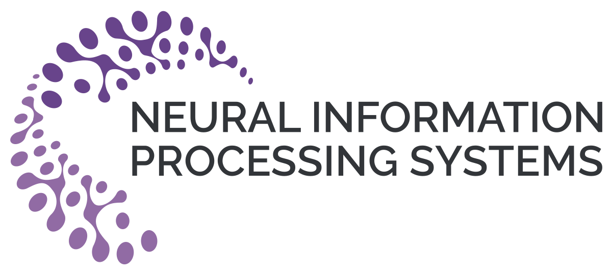

# Bias-in-Evaluation-Processes

This repository contains the code for reproducing the simulations in our paper

**Bias in Evaluation Processes: An Optimization-Based Model** 
*L. Elisa Celis, Amit Kumar, Anay Mehrotra, Nisheeth K. Vishnoi* 
NeurIPS 2023

  

## Running Simulations

To reproduce the simulations in Section 4.1 run the following Jupyter notebooks
1. validation-jee-data.ipynb
2. validation-jee-data-gender.ipynb
3. validation-semantic-scholar.ipynb
4. validation-network-simulation.ipynb

To reproduce the simulations in Section 4.1 and H.1 run the following Jupyter notebooks
1. selection-simulation.ipynb
2. selection-simulation-case-study.ipynb

